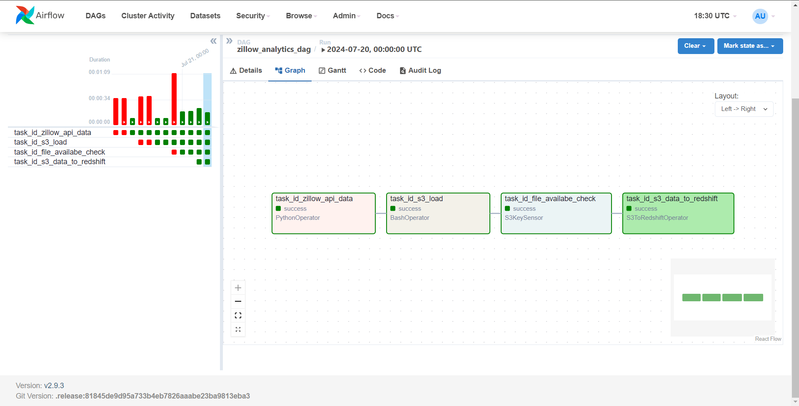
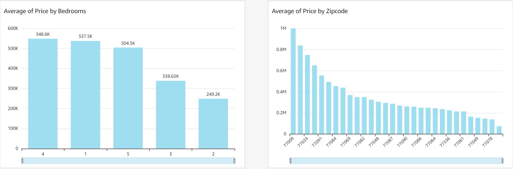

# realestate-data-analysis-pipeline-aws

## Project Overview

This project automates a Python ETL process to extract real estate property data from the Zillow Rapid API. The data is loaded into an Amazon S3 bucket, triggering AWS Lambda functions to transform the data, convert it into CSV format, and load it into another S3 bucket using Apache Airflow. Apache Airflow utilizes an S3KeySensor operator to monitor the data before loading it into Amazon Redshift. Once the data is loaded into Redshift, Amazon QuickSight is connected to visualize the Zillow data.

## Table of Contents

- [Architecture](#architecture)
- [Technologies Used](#technologies-used)
- [Setup and Installation](#setup-and-installation)
- [ETL Process](#etl-process)
- [Data Transformation](#data-transformation)
- [Data Loading](#data-loading)
- [Data Visualization](#data-visualization)
- [Insights Gained](#insights-gained)
- [Conclusion](#conclusion)

## Architecture

This project consists of several components working together to achieve an automated ETL pipeline:

1. **Zillow Rapid API**: The source of the real estate property data.
2. **Python Script**: Extracts data from the Zillow API and saves it to an S3 bucket.
3. **AWS Lambda Functions**: Two Lambda functions handle data transformation and loading.
4. **Amazon S3**: Stores both raw and transformed data.
5. **Apache Airflow**: Manages the workflow, including data extraction, transformation, and loading into Redshift.
6. **Amazon Redshift**: The data warehouse where the transformed data is stored.
7. **Amazon QuickSight**: Used for data visualization and analysis.

## Technologies Used

- **Python**: For scripting the ETL process.
- **Zillow Rapid API**: Source of real estate property data.
- **Amazon S3**: Storage service for raw and transformed data.
- **AWS Lambda**: Serverless compute service for data transformation.
- **Apache Airflow**: Workflow management platform.
- **Amazon Redshift**: Data warehouse for storing transformed data.
- **Amazon QuickSight**: Business intelligence service for data visualization.

## Setup and Installation

### Prerequisites

- Python 3.x
- AWS Account
- Apache Airflow
- Amazon Redshift Cluster
- Amazon QuickSight Account

## ETL Process
### Extract
* The process begins with a Python script running as part of an Apache Airflow DAG. This script makes an API call to the Zillow Rapid API to fetch real estate property data.
* The extracted data is saved as a JSON file in a raw data S3 bucket.
### Transform
* When new data is saved in the raw data S3 bucket, an AWS Lambda function is triggered.
* The first Lambda function copies the raw data from the initial S3 bucket to a secondary S3 bucket for raw data storage.
* Another Lambda function then processes the raw data, transforming it by selecting specific columns, handling missing values, and converting it into a CSV format.
* The transformed CSV data is then uploaded to a separate S3 bucket designated for transformed data.
### Load
* Apache Airflow utilizes an S3KeySensor operator to monitor the S3 bucket for the presence of the transformed CSV file.
* Once the file is detected, another task in the Airflow DAG loads the data into an Amazon Redshift table for storage and further analysis.
## Data Transformation
* The data transformation step involves cleaning the data, selecting relevant columns (e.g., bathrooms, bedrooms, city, homeStatus, homeType, livingArea, price, rentZestimate, zipcode), and handling missing values.
* The transformed data is then saved as a CSV file and uploaded to the designated S3 bucket.
## Data Loading
* The transformed data is loaded into an Amazon Redshift table using the S3ToRedshiftOperator in Apache Airflow.
* This operator ensures that the data is correctly loaded into Redshift, where it can be queried and analyzed.
## Data Visualization
* Amazon QuickSight is connected to the Amazon Redshift cluster to create visualizations and dashboards.
* The visualizations provide insights into the real estate market, such as average price by number of bedrooms and average price by zipcode.

> Apache Airflow DAG showing the ETL process workflow

> Amazon QuickSight visualizations of the Zillow data

## Insights Gained
Working on this project provided several valuable insights:

1. End-to-End Data Pipeline Creation: Gained hands-on experience in building and automating a complete ETL pipeline from data extraction to visualization using various AWS services.
2. API Integration: Learned how to effectively interact with and extract data from an external API (Zillow Rapid API).
3. AWS Lambda Functions: Developed skills in creating and managing serverless functions to handle data transformation and loading tasks.
4. Apache Airflow: Acquired proficiency in using Apache Airflow to orchestrate complex workflows, monitor task dependencies, and handle scheduling.
5. Data Warehousing: Understood the process of loading and managing data in Amazon Redshift, including schema design and data loading best practices.
6. Data Visualization: Improved capabilities in creating insightful visualizations and dashboards using Amazon QuickSight to analyze real estate data trends.

## Conclusion
This project demonstrates an end-to-end data engineering pipeline, from data extraction to visualization, using various AWS services and Python. It automates the entire ETL process, ensuring data is accurately extracted, transformed, loaded, and visualized.

Future Work
1. Implement additional data quality checks.
2. Enhance the transformation logic for more complex data scenarios.
3. Integrate other data sources to enrich the analysis.
